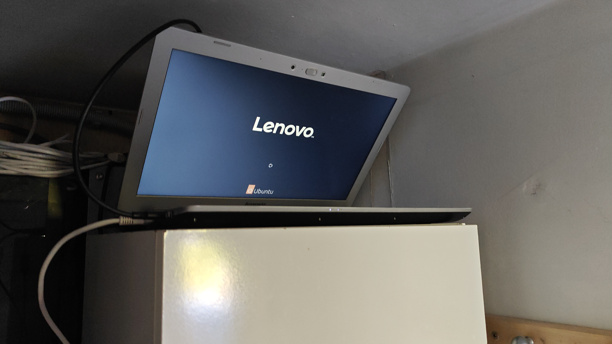
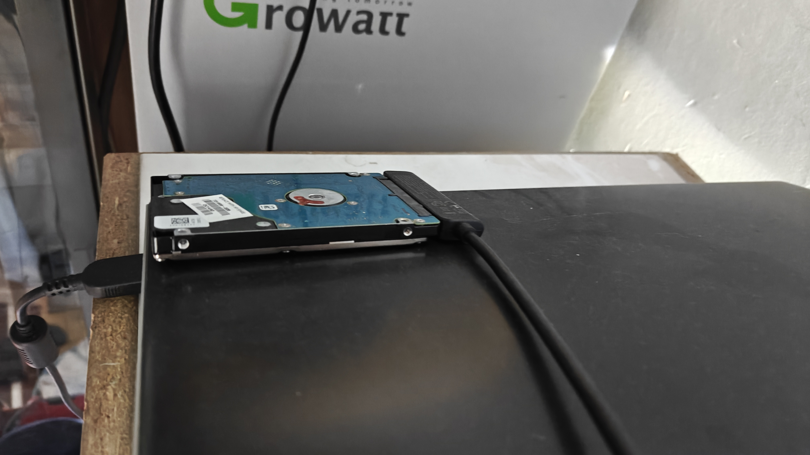
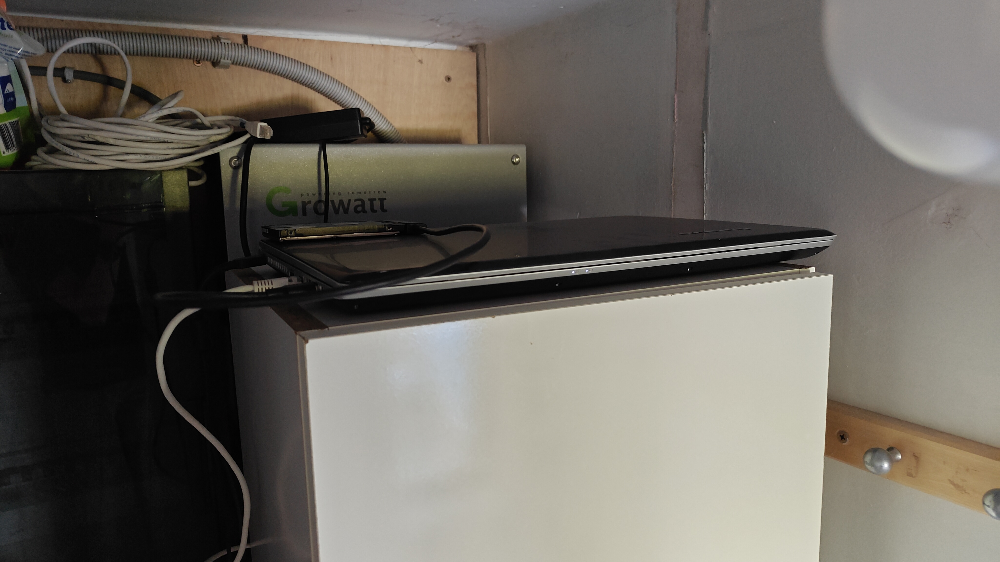

# Screenshots

This document keeps track of screenshots and photos that demonstrate the project.

---

## Hardware

- 
- 
- 

---

## Operating system

- [ ] Ubuntu/Linux system information
- [ ] CPU information
- [ ] RAM information
- [ ] Storage information

---

## Server management

- [ ] Cockpit overview
- [ ] Cockpit resource usage
- [ ] Cockpit storage
- [ ] Cockpit services

---

## Media

- [ ] Jellyfin home screen
- [ ] Jellyfin media library
- [ ] Jellyfin playback
- [ ] Jellystat dashboard
- [ ] Jellyseerr request interface

---

## Automation

- [ ] Sonarr dashboard
- [ ] Radarr dashboard
- [ ] Prowlarr dashboard
- [ ] qBittorrent dashboard

---

## Monitoring

- [ ] Uptime Kuma dashboard
- [ ] Watch Your LAN
- [ ] Discord notification

---

## Networking

- [ ] Tailscale connection
- [ ] AdGuard Home dashboard
- [ ] Nginx Proxy Manager

---

## Smart home

- [ ] Home Assistant dashboard

---
